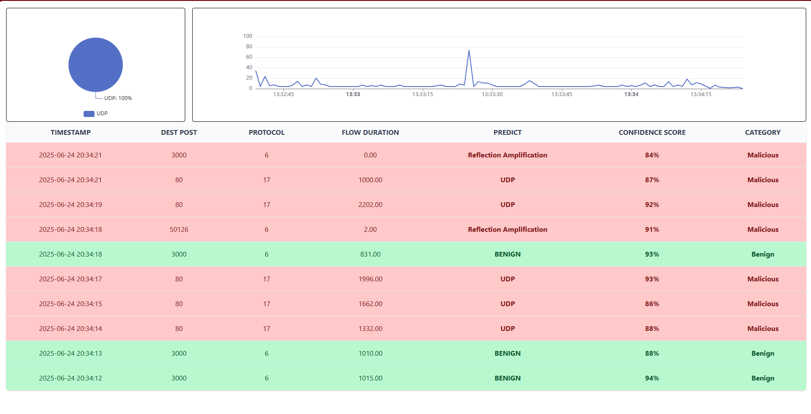

<h1 align="center">
  <br>
  
  <br>
  Intrusion Detection System (IDS) using TabNet
  <br>
</h1>

<h5 align="center">
</h5>

## 📌 Overview

This project builds an Intrusion Detection System (IDS) using TabNet, a deep learning model optimized for tabular data. It aims to detect and classify network intrusions with high accuracy and interpretability.



## ✨ Key highlights

- 🚀 Built with TabNet for deep feature learning on tabular data  
- 🔍 Supports multi-class intrusion detection (UDP Flood, Syn Flood)  
- 📊 Evaluated with key metrics: Accuracy, Precision, Recall, F1-score  
- 🧠 Model interpretability via attention-based feature selection  

## 📊 Dataset

This project uses the CIC DDoS 2019 dataset provided by the Canadian Institute for Cybersecurity. It contains real network traffic data designed to evaluate DDoS detection systems under various modern attack scenarios.

#### Key characteristics:

📁 Over 50 GB of raw network traffic data (PCAP + CSV format)

🎯 Includes multiple types of DDoS attacks, such as:

- HTTP Flood

- SYN Flood

- UDP Flood

- ICMP Flood

- DNS Amplification

📈 Labeled data with extracted features (e.g., flow duration, packet size, protocol, etc.)

👨‍💻 Suitable for machine learning and deep learning applications in IDS research

## ⚙️ Setup & Run

#### This project consists of three main components:

- 📺 Frontend (Angular) – User Interface to visualize real-time intrusion detection results

- 🛠️ Backend (NestJS) – API server to receive predictions and serve them to the UI

- 🐍 Python Script – Continuously captures network traffic, runs the TabNet model, and sends predictions to the backend

#### 1️⃣ Frontend (Angular UI)

```bash
cd UI_monitor/monitoring-client
npm install
ng s
```

#### 2️⃣ Backend (NestJS API)

```bash
cd UI_monitor/monitoring-server
npm install
npm run start dev
```

#### 3️⃣ Python Prediction Script (only on linux)

```bash
source .venv/bin/activate
pip install -r requirements.txt
sudo $(which python3) main.py
```

#### 🔄 Workflow Summary

[Network Traffic] ──▶ [Python Script: TabNet] ──▶ [NestJS Backend API] ──▶ [Angular UI]
                          
#### 🔧 Note

Frontend and Backend can run on Windows. Python Prediction Script runs only on Linux and don't forget to change the IP for the machine running Backend to send result to Backend.

```
# network_traffic_monitoring/packages/shared/shared_data.py, line 18
self.api_base = 'http://192.168.20.254:3000'
```

## 🧰 Technologies

<p align="left">        </p>

## 🛡 License

This project is licensed under the [MIT License](./LICENSE) – feel free to use and modify with attribution.
